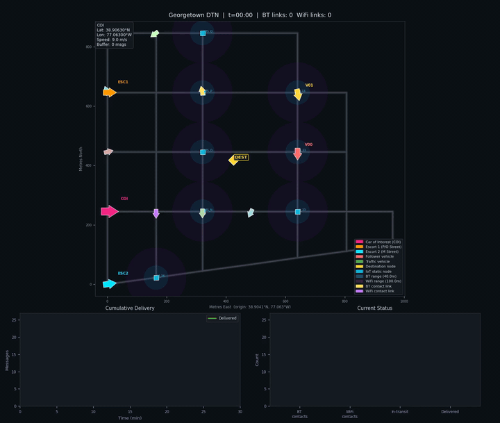

# DTN Anytime Scheduler — Georgetown

**A Delay-Tolerant Network simulation over a real Georgetown DC road network, combining multi-objective offline optimization with an online epsilon-constraint LP scheduler.**


---

## Demo



*30-minute Georgetown DC simulation: COI (magenta), escorts and followers (red), traffic (green/purple/teal), and IoT static nodes (blue squares). Contact links flash yellow (Bluetooth) or purple (WiFi) during active transfers.*

---

## Overview

This project models a **store-carry-forward vehicular DTN** in Georgetown, Washington DC. The network has two competing missions running simultaneously over the same vehicle fleet and radio bandwidth:

**Mission 1 — COI surveillance.** A **Car of Interest (COI)** circulates through the neighborhood. Static IoT nodes (intersections, sensors) observe the COI when it passes within range and generate small, time-sensitive *sighting messages* recording its position and timestamp. These messages relay through the static node infrastructure (node → vehicle → node → … → destination) rather than vehicle-to-vehicle, mimicking a real sensor network relay chain.

**Mission 2 — Large file transfer.** One randomly chosen edge node holds a large file pre-divided into **1,000 chunks**. The same data mules must also carry chunks toward the destination. Chunks spread vehicle-to-vehicle via spray-and-wait — but compete directly with sighting messages for the same limited buffer space and radio bandwidth on every vehicle.

The scheduler resolves this tension in two phases:

| Phase | Algorithm | When |
|---|---|---|
| Offline | NSGA-II Pareto optimizer | Once at startup |
| Online | Epsilon-constraint LP | At every contact event |

The simulation runs on a **real OSM road graph** of Georgetown (M, N, O, P, Q Streets NW and Wisconsin Ave NW), with kinematic vehicles obeying friction-limited acceleration and turn-proportional speed reduction.

---

## Features

- **Real OSM road network** — live download via `osmnx` (falls back to bundled GraphML); 94 nodes, 137 edges within the Georgetown bounding box
- **Kinematic vehicle physics** — friction-limited acceleration, heading-error turn slowdown, waypoint-following
- **Heterogeneous vehicle fleet**
  - COI on a fixed closed circuit (magenta)
  - Escort vehicles on parallel adjacent-street circuits (red)
  - Follower vehicles with reactive turn bias toward the COI (red)
  - Background traffic with probabilistic intersection routing (green/purple/teal)
- **Heterogeneous radio model** — each vehicle and static node is independently assigned a radio type at startup:
  - `bt` — Bluetooth only (45 m range)
  - `wifi` — WiFi only (65 m range)
  - `both` — dual radio; WiFi preferred when shared
  - COI and escorts always carry both radios; civilian traffic is randomly 1/3 BT / 1/3 WiFi / 1/3 both
- **Relay delivery chain** — COI sightings travel `source node → vehicle → relay node → vehicle → destination` via static node infrastructure; V2V contact is available to **all message types** but requires a shared radio channel (BT↔BT, WiFi↔WiFi, or either↔both)
- **Two-tier DTN scheduling**
  - Offline NSGA-II explores the 4-objective Pareto front (benefit ↑, CPU ↓, memory ↓, bandwidth ↓)
  - Online epsilon-constraint LP maximizes message benefit at each contact, respecting hard resource ceilings
- **Competing message types** — three types with strict priority ordering
  - `FILE_ACK` — completion ACK back to source; highest priority, rides any vehicle
  - `COI_SIGHTING` — small, time-sensitive (TTL 900s); relayed via static nodes only
  - `FILE_CHUNK` — one fragment of 1,000-chunk file; lowest individual priority, no TTL urgency
- **Priority queue vehicle buffer** — type-ranked eviction (ACK > Sighting > Chunk); a sighting will never be bumped to make room for a chunk regardless of age
- **ACK feedback loop** — destination generates `FILE_ACK` at 25/50/75/100% completion thresholds; ACKs ride vehicles back to source, which stops redundantly resending confirmed chunks
- **Spray-and-wait forwarding** — bounded replication with separate caps for sightings and chunks
- **Full connectivity logging** — every contact window logged with duration, min/max distance, lat/lon, and technology
- **Single-run animation** — dark-theme top-down map with directional car icons, range rings, contact links, live delivery curve, and sighting log panel
- **Batch runner** — run N independent randomized trials, write per-run CSV, print aggregate statistics

---

## Architecture

```
┌──────────────────────────────────────────────────────────────────┐
│              run_simulation.py  /  run_batch.py                  │
│  ┌──────────────┐  ┌──────────────────┐  ┌──────────────────┐   │
│  │  network/    │  │     moo/         │  │  simulation/     │   │
│  │  georgetown  │  │  nsga2 (offline) │  │  engine.py       │   │
│  │  .py         │  │  scheduler (LP)  │  │  vehicle.py      │   │
│  │  Road graph  │  │  Pareto front    │  │  static_node.py  │   │
│  └──────┬───────┘  └────────┬─────────┘  └──────┬───────────┘   │
│         │                   │                    │               │
│         └───────────────────┴────────────────────┘               │
│                             │                                    │
│                     ┌───────▼────────┐                           │
│                     │   output/      │                           │
│                     │  writer.py     │                           │
│                     │  animator.py   │                           │
│                     └───────────────-┘                           │
└──────────────────────────────────────────────────────────────────┘
```

### Offline NSGA-II

Runs once at startup over a synthetic population of scheduling decisions. Each individual encodes a message priority ordering; fitness is evaluated on four objectives:

1. **Benefit** — urgency × recency × inverse-distance score (maximize)
2. **CPU usage** — fraction of compute budget consumed (minimize)
3. **Memory usage** — fraction of memory budget consumed (minimize)
4. **Bandwidth** — fraction of contact window bandwidth consumed (minimize)

The Pareto front is retained and wrapped in a `decode_fn` used by the online scheduler to score incoming messages.

### Online Epsilon-Constraint LP

Triggered at every contact event between a vehicle and a static IoT node. Formulates:

```
maximize   Σ benefit_i · x_i
subject to Σ cpu_i     · x_i  ≤  CPU_RESERVE_FLOOR
           Σ mem_i     · x_i  ≤  MEM_RESERVE_FLOOR
           Σ bw_i      · x_i  ≤  BW_FRACTION · contact_window
           x_i ∈ {0, 1}
```

Solved via `scipy.optimize.linprog` with LP relaxation and greedy rounding.

### Kinematic Vehicle Physics

Each vehicle maintains `(x, y, speed, heading, accel)` and updates every timestep:

1. Compute vector to current waypoint
2. Derive desired heading; compute turn error `Δh ∈ [−π, π]`
3. Target speed = `MAX_SPEED × max(TURN_SLOWDOWN, 1 − |Δh|/π × (1 − TURN_SLOWDOWN))`
4. Friction-limited acceleration: `a ≤ min(MAX_ACCEL, μg)`
5. Rate-limited heading update
6. Integrate position; advance waypoint when within `WAYPOINT_RADIUS`

### Relay Delivery Model

COI sightings travel **through static node infrastructure**, not vehicle-to-vehicle:

```
COI passes IoT node → node generates sighting
       ↓
Vehicle passes node → picks up sighting
       ↓
Vehicle passes another node → deposits copy (store-and-forward)
       ↓
Eventually a vehicle near the destination delivers it
```

Vehicle-to-vehicle contact works for **all message types** as long as both vehicles share a radio channel (BT↔BT, WiFi↔WiFi, or either↔both). COI sightings can therefore spread V2V in addition to the static node relay chain.

### Competing Message Types

| Type | Priority rank | TTL | Spray cap | Delivery path |
|---|---|---|---|---|
| `FILE_ACK` | 3 (highest) | 2 hours | — | Via vehicles to file source node |
| `COI_SIGHTING` | 2 | 15 min | `MAX_SPRAY_COPIES=4` | Node relay chain to destination |
| `FILE_CHUNK` | 1 (lowest) | 2 hours | `CHUNK_SPRAY_COPIES=3` | V2V spray to destination |

**Buffer eviction** is type-ranked: a `FILE_CHUNK` is always evicted before a `COI_SIGHTING`, regardless of the sighting's age or hop count. Within the same type, `priority_score()` breaks ties.

---

## Road Network

Georgetown, Washington DC — real OSM intersection coordinates:

```
Q Street  ·——·    ·——·    ·——·——·
          |        |        |
P Street  ·——·——WIS_P——·——·——·
          |        |        |
O Street  ·——·——WIS_O——·——·——·
          |        |        |
N Street  ·——·——WIS_N——·——·——·  ← COI route
          |        |        |
M Street  ·——·——M_35——·——·——·
         37th    Wisc    33rd  31st
```

**Nodes:** 94 OSM nodes (+ 4 randomly placed edge nodes per run)
**Edges:** 137 road segments
**Static IoT nodes:** `WIS_N`, `WIS_O`, `WIS_P`, `WIS_Q`, `N_33`, `O_33`, `M_36`, `P_33`

---

## Installation

```bash
# Python 3.10+ required
git clone https://github.com/Kenzie-Meni/GT-Simulator.git
cd GT-Simulator

python3 -m venv venv
source venv/bin/activate        # Windows: venv\Scripts\activate

pip install -r requirements.txt

# ffmpeg required for MP4 animation output
# macOS:  brew install ffmpeg
# Ubuntu: sudo apt install ffmpeg

# Optional: live OSM graph download (falls back to bundled GraphML if unavailable)
pip install osmnx
```

---

## Usage

### Single run (with animation)

```bash
python run_simulation.py
```

Outputs written to `data/`:

| File | Description |
|---|---|
| `connectivity.csv` | One row per contact window — node pair, technology, duration, distance, lat/lon |
| `connectivity.json` | Same data as JSON with summary statistics |
| `simulation.mp4` | Animated top-down map of the full simulation |

See [data/DATA_DICTIONARY.md](data/DATA_DICTIONARY.md) for a full description of every field.

### Batch run (100 randomized trials)

```bash
python run_batch.py                        # 100 runs, seeds 0–99
python run_batch.py --n 50                 # 50 runs
python run_batch.py --n 200 --base-seed 1000
```

Outputs written to `data/`:

| File | Description |
|---|---|
| `batch_results.csv` | One row per run — all 27 metrics for every seed |
| `batch_summary.txt` | Aggregate table: mean / std / min / P25 / P50 / P75 / max |

See [data/DATA_DICTIONARY.md](data/DATA_DICTIONARY.md) for a full description of every field.

---

## Performance

Measured on a MacBook (Apple Silicon, macOS 14):

| Task | Wall time |
|---|---|
| Graph load + NSGA-II setup | ~0.6 s |
| 30-min simulation (no animation) | ~0.5 s |
| 30-min simulation + MP4 render | ~50 s |
| 100-run batch (no animation) | ~60 s |

The simulation runs much faster than real time — a 30-minute scenario finishes in under a second. Animation rendering (600 frames → MP4 via ffmpeg) dominates the wall time for single runs. For batch analysis, disable animation (`RECORD_ANIMATION = False` in `config.py` or use `run_batch.py` which disables it automatically).

---

## Configuration

All parameters live in [`config.py`](config.py). Nothing else needs to be edited for most experiments.

### Timing

| Parameter | Default | Description |
|---|---|---|
| `SIM_DURATION` | `1800` | Simulation length (seconds) |
| `DT` | `1.0` | Physics timestep (seconds) |
| `FRAME_INTERVAL` | `3` | Seconds between captured animation frames |

### Communication Ranges

| Parameter | Default | Description |
|---|---|---|
| `BT_RANGE` | `45.0` | Bluetooth contact range (metres) |
| `WIFI_RANGE` | `65.0` | WiFi contact range (metres) |

### Vehicle Fleet

| Parameter | Default | Description |
|---|---|---|
| `NUM_VEHICLES` | `9` | Total background traffic vehicles |
| `NUM_ESCORTS` | `2` | Escort vehicles on parallel circuits |
| `NUM_FOLLOWERS` | `2` | Traffic vehicles that bias turns toward COI |
| `COI_START_SPEED` | `7.0` | COI initial speed (m/s ≈ 15.7 mph) |
| `VEHICLE_SPEED_MIN` | `4.0` | Traffic min speed (m/s ≈ 9 mph) |
| `VEHICLE_SPEED_MAX` | `9.0` | Traffic max speed (m/s ≈ 20 mph) |
| `ROUTE_LENGTH` | `20` | Seed route length for dynamic-routing vehicles |

### Physics

| Parameter | Default | Description |
|---|---|---|
| `MAX_SPEED` | `11.0` | Hard speed cap (m/s ≈ 25 mph) |
| `MIN_SPEED` | `1.5` | Minimum speed — vehicles never fully stop |
| `MAX_ACCEL` | `2.0` | Maximum acceleration (m/s²) |
| `MAX_BRAKE` | `4.0` | Maximum deceleration (m/s²) |
| `MU_FRICTION` | `0.7` | Road surface friction coefficient |
| `TURN_SLOWDOWN` | `0.45` | Speed fraction retained at 180° turn |
| `WAYPOINT_RADIUS` | `15.0` | Capture radius for waypoint advance (metres) |

### DTN / Messaging

| Parameter | Default | Description |
|---|---|---|
| `MESSAGE_TTL` | `900` | Seconds before a sighting expires (15 min) |
| `MAX_SPRAY_COPIES` | `4` | Max copies of one sighting in the network |
| `BUFFER_CAPACITY` | `10` | Max messages a vehicle can carry (priority queue) |
| `COI_SIGHTING_INTERVAL` | `30` | Seconds between COI sighting events at nearby nodes |

### File Transfer

| Parameter | Default | Description |
|---|---|---|
| `FILE_CHUNK_COUNT` | `1000` | Total chunks in the large file |
| `CHUNK_BASE_BENEFIT` | `0.15` | Flat LP benefit per chunk (vs sighting ~0.6–0.9) |
| `CHUNK_SPRAY_COPIES` | `3` | Max copies of one chunk in the network |
| `CHUNK_TTL` | `7200` | Chunk validity window (2 hours) |
| `ACK_THRESHOLDS` | `[0.25, 0.50, 0.75, 1.00]` | Completion fractions that trigger a return ACK |

### Scheduler Resources

| Parameter | Default | Description |
|---|---|---|
| `CPU_RESERVE_FLOOR` | `0.20` | Keep 20% CPU free |
| `MEM_RESERVE_FLOOR` | `0.15` | Keep 15% memory free |
| `BW_FRACTION` | `0.80` | Use at most 80% of contact window bandwidth |

### NSGA-II

| Parameter | Default | Description |
|---|---|---|
| `NSGA2_GENERATIONS` | `40` | Offline optimizer generations |
| `NSGA2_POP_SIZE` | `60` | Population size per generation |

### Animation

| Parameter | Default | Description |
|---|---|---|
| `RECORD_ANIMATION` | `True` | Save MP4 (set False to skip) |
| `ANIMATION_FPS` | `15` | Output frame rate |
| `ANIMATION_DPI` | `120` | Output resolution |

---

## Sample Results

Single run with default config (seed=42, 1800s simulation):

```
================================================
  DTN Run Summary   seed=42
================================================
  Destination      : WIS_O
  File source node : EDGE_2

  COI SIGHTINGS
    Generated      : 8
    Delivered      : 7  (87.5%)
    Avg / P50 delay: 453.0s / 453.0s
    Min / Max delay: 60.0s / 872.0s
    Avg hops       : 1.0
    Expired        : 1
    Time to first  : 60.0s

  FILE CHUNKS
    Total / Delivered: 1000 / 71  (7.1%)
    Rate           : 2.4 chunks/min
    Avg delay      : N/A
    Time to first  : N/A

  FILE ACKs
    Generated      : 0
    Delivered      : 0  (0.0%)

  NETWORK
    Connectivity windows : 863  (BT: 329, WiFi: 534)
    Avg window duration  : 9.1s
    LP solves / fallbacks: 75 / 0
    Total transfers      : 93
================================================
```

**Reading the numbers:** Sightings achieve ~88% delivery because they dominate the priority queue and relay through the dense static node infrastructure. File chunks reach only ~7% completion in 30 minutes — the same vehicle buffers carry both, and 1,000 chunks competing for 10-slot buffers accumulate slowly. Full file delivery would require several hours of simulated time, more vehicles, or relaxed spray limits. No ACKs are generated until 25% chunk completion is crossed.

---

## Batch Analysis

Running 100 randomized trials reveals the distribution across random seeds:

```bash
python run_batch.py --n 100
```

Each run randomizes: destination node, file source node, vehicle radio types, static node radio types, edge node placement, vehicle starting positions, vehicle speeds, vehicle initial headings, and dynamic routing decisions. This allows statistical characterization of DTN performance across different network topologies and traffic conditions.

The output `data/batch_results.csv` contains one row per run with all 27 metrics, suitable for plotting delivery rate distributions, delay CDFs, or chunk completion vs. connectivity window counts.

---

## Randomization Sources

Each run draws from 9 independent random sources (all seeded by the run seed for reproducibility):

| Source | Effect |
|---|---|
| Destination node | Changes where sightings and chunks must reach |
| File source node | Changes which static node seeds the 1,000 chunks |
| Vehicle radio types | ~25% fewer contacts when BT-only meets WiFi-only vehicles |
| Static node radio types | Same — affects node→vehicle relay opportunities |
| Edge node placement | 4 extra nodes placed randomly along road segments |
| Traffic start positions | Different initial vehicle distribution across the map |
| Traffic speeds | Drawn from [4.0, 9.0] m/s uniform |
| Traffic headings | Initial heading drawn from [0, 2π] |
| Dynamic routing | Probabilistic turn choices at each intersection |

---

## Project Structure

```
GT-Simulator/
├── core/
│   ├── message.py          # Message dataclass — urgency scoring, expiry, hop tracking
│   ├── resource.py         # ResourceSnapshot — CPU/memory/bandwidth budget
│   └── utils.py            # ll2xy, xy2ll, haversine_m, dist_m, compatible_range, contact_tech
├── simulation/
│   ├── vehicle.py          # Kinematic vehicle — physics, dynamic routing, DTN buffer
│   ├── static_node.py      # IoT static node — sighting generation, LP scheduler
│   └── engine.py           # Main loop — stepping, contact detection, relay model, frame recorder
├── moo/
│   ├── nsga2.py            # Offline NSGA-II Pareto optimizer
│   └── scheduler.py        # Online epsilon-constraint LP (scipy linprog)
├── network/
│   ├── georgetown.py       # Road graph — OSM download, bundled coords, name_to_node
│   └── georgetown.graphml  # Pre-built graph (auto-regenerated if missing)
├── output/
│   ├── writer.py           # CSV + JSON connectivity log writers
│   └── animator.py         # MP4 builder — car icons, range rings, stats panels, sighting log
├── tests/
│   ├── test_moo.py
│   ├── test_vehicle.py
│   └── test_connectivity.py
├── assets/
│   └── demo.gif            # Animation preview
├── data/                   # Simulation outputs (gitignored except assets)
├── run_simulation.py       # Single-run entry point + simulate() / _compute_stats() helpers
├── run_batch.py            # Batch runner — N runs, aggregate CSV + summary table
├── config.py               # All tunable parameters
└── requirements.txt
```

---

## Dependencies

| Package | Purpose |
|---|---|
| `numpy` | Numerical arrays, NSGA-II fitness evaluation, batch statistics |
| `scipy` | `linprog` for the online LP scheduler |
| `matplotlib` | Animation rendering (FuncAnimation + FancyArrow) |
| `networkx` | Road graph, shortest-path, neighbor traversal |
| `ffmpeg` | MP4 encoding (system dependency, not pip) |

Optional:
- `osmnx` — live OSM graph download (falls back to bundled GraphML if unavailable)
- `jupyter` / `ipykernel` — notebook exploration

---

## License

MIT
